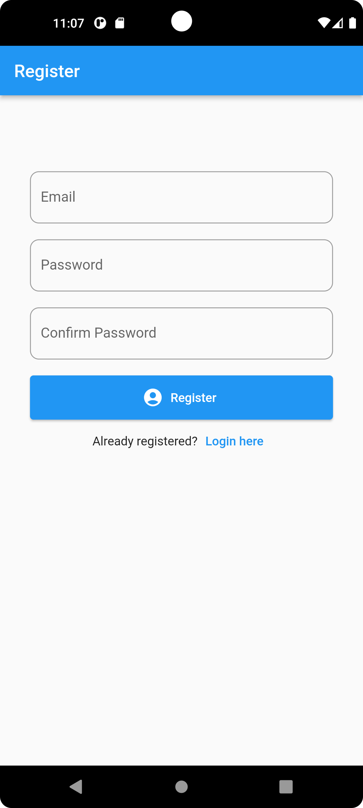
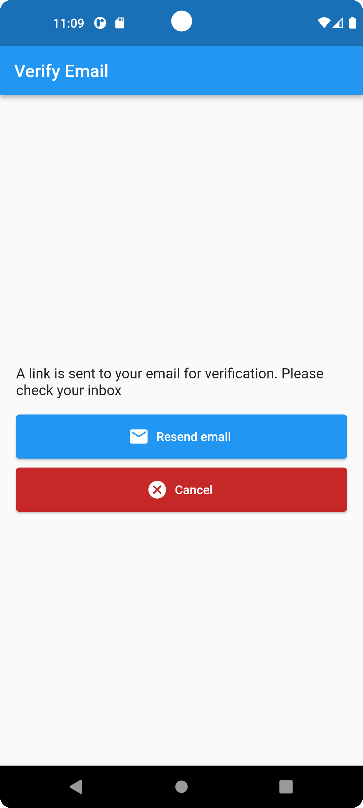
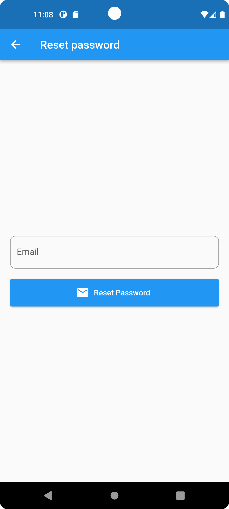
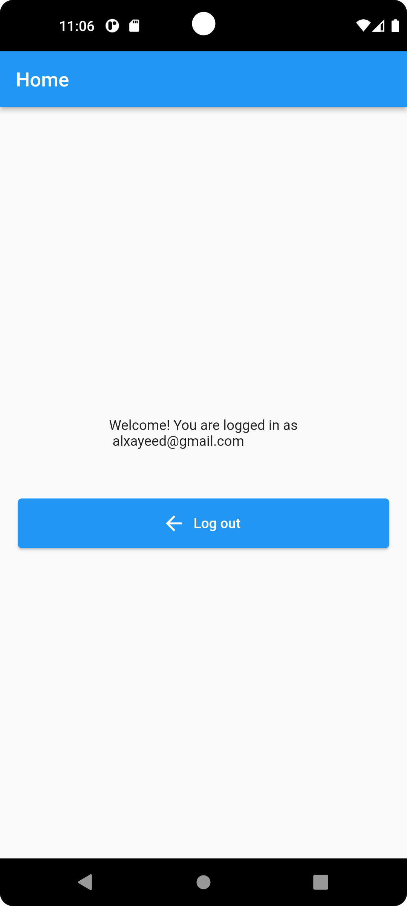
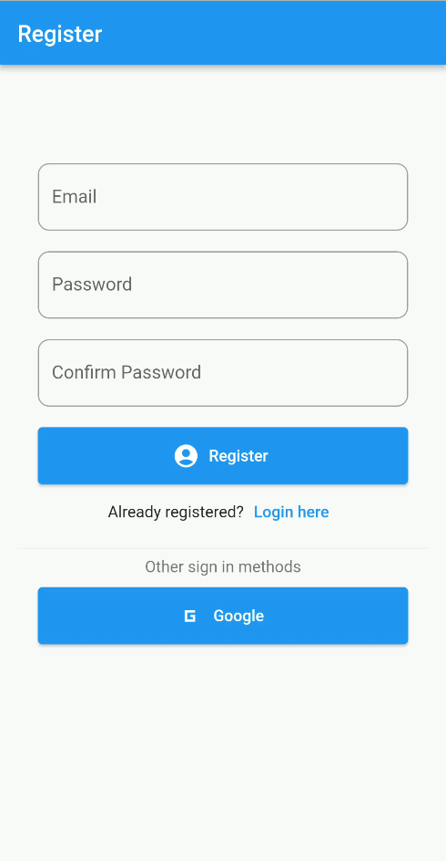
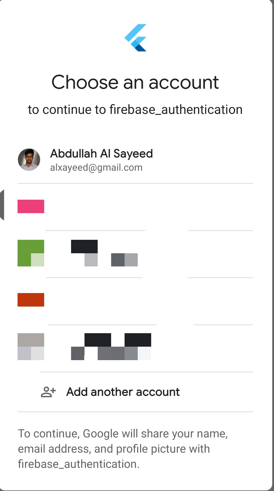

# Firebase Authentication

### A flutter project to demonstrate different firebase authentications.

In this project, firebase is integrated with flutter with different authenticatin features.

## Features

- User Registration
- Login
- Email Verification
- Forgot Password
- Google Authentication

 

## Stacks

- Dart
- Flutter
- Firebase

 

## Topics

1. Firebase Authentication
2. Google Sign in

 

## Showcase

<table>

  <tr>
    <td></td>
    <td></td>
        <td></td>
  </tr>
  <tr>
    <td></td>
    <td></td>
  </tr>
    <tr>
    <td>Google sign in</td>
    <td>Accounts </td>
  </tr>
  <tr>
    <td></td>
    <td></td>
  </tr>

 </table>
 
